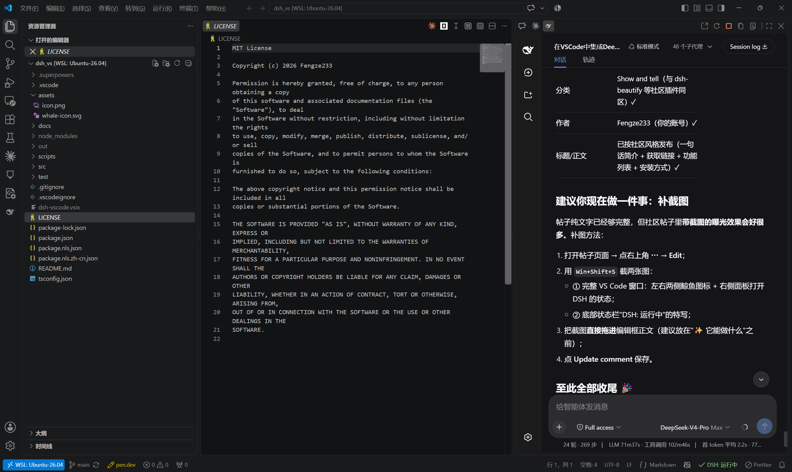
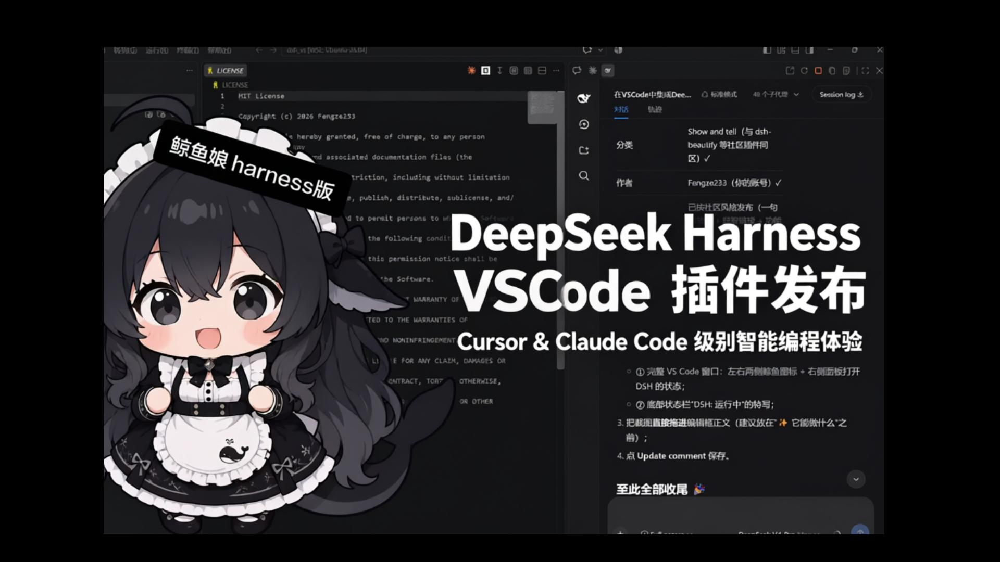

# DSH for VS Code 🐳

[](https://opensource.org/licenses/MIT)
[](https://marketplace.visualstudio.com/items?itemName=Fengze233.dsh-vscode-panel)
[](https://github.com/Fengze233/dsh-vscode)
[](https://github.com/topics/dsh-plugin)
[](https://code.visualstudio.com/)

**English** | [中文](README.zh.md)

Use the [DeepSeek Harness (DSH)](https://github.com/deepseek-ai/deepseek-harness) web UI right inside VS Code: click a sidebar icon to embed DSH, which auto-starts (or reuses) the `dsh web` service — code and AI interface side by side, no more switching between terminal, browser, and IDE.

Works with **DSH 0.1.2 and newer**, including its one-time-token browser authentication (auto sign-in, no manual step) — see [DSH ≥0.1.2 authentication](#-dsh-012-authentication--the-local-relay). Older DSH (≤ 0.1.1, no auth) keeps working unchanged.

## 📸 Screenshot



## 🎬 Demo video

[](https://www.bilibili.com/video/BV1p8bD6dE18)

*59-second demo on Bilibili (Chinese): [BV1p8bD6dE18](https://www.bilibili.com/video/BV1p8bD6dE18)*

---

## ✨ Features

- 🖱️ **One-click open**: a DSH whale icon in both the left Activity Bar and the right Secondary Side Bar — click either to embed the DSH page in that sidebar;
- 🚀 **Automatic service management**: auto-detects the port — reuses an already-running `dsh web`, otherwise starts one silently in the background and loads it once ready;
- 🔄 **Live status sync**: four-state status bar indicator (running green / starting yellow / failed red / stopped gray); click it to toggle the panel;
- 🛟 **Error fallbacks**: port occupied, `dsh` missing, start timeout, crash/disconnect — each has a dedicated page with one-click reconnect; if the configured port is taken by another program, the extension temporarily falls back to the first free port for that session, never a blank screen;
- 🌐 **Bilingual UI**: copy follows the VS Code display language — Chinese for `zh-*`, English otherwise;
- 📋 **Copy/Paste/Context menu, works out of the box**: fixes the macOS webview quirk where `Cmd+C` / `Cmd+V` and the right-click menu silently fail inside the embedded DSH page — the panel ships its own standard edit shortcut simulation and a context menu (Copy/Paste/Cut/Select All/Undo/Redo), while plain-browser usage and every existing feature stay untouched;
- 🧹 **Clean exit**: closing the window stops the auto-started service, no zombie processes; manually started services are never touched;
- 🔒 **Security boundary**: loopback addresses only (127.0.0.1 / localhost / [::1]); no credentials are read.
- 🔐 **DSH 0.1.2 auth-aware**: the extension parses the one-time launch URL from the service log, exchanges it for DSH's signed browser cookie (valid 30 days, survives service restarts) and serves the panel through a local loopback relay that presents that session for the iframe — so the embedded UI keeps working even though DSH's `SameSite=Strict` cookie can never be used inside a cross-site iframe. A session that expires is re-acquired automatically (a self-started service) or after one paste (an externally started service);
- 🔝 **Editor title-bar icon**: a DSH whale button sits in the top-right of the editor tab bar (like Claude Code) — one click opens the right-side DSH panel;
- 🌐 **SSH Remote (opt-in)**: when connected to a remote host, run dsh on the remote and open the panel through a VS Code tunnel (`dsh.remote.enabled`, off by default);
- 🖼️ **Free image upload**: send images even when the active model has no vision — the image is cached in the workspace and dispatched as a file-path reference, letting the model inspect it with an image tool (files are cleaned up when the panel closes; opt-out via `dsh.image.fallback`);
- 🪟 **No surprise browser window**: `dsh web` is started with `--no-open` by default (restore with `dsh.openInBrowser`).
- 🧠 **File context integration**: the panel toolbar shows the current file with an *Add* button and an *Auto-follow* toggle — inject the current file into the AI context in one click, or let it follow automatically as you switch files (injected into the most recent session of the current project, auto-created if none);
- 🖱️ **Right-click menus**: "Add to Context / Ask DSH / Send Selection" directly from the editor, the explorer, and the editor title bar;
- 📁 **Workspace adaptation**: switching VS Code workspaces restarts the DSH service with the new project as its working directory and idempotently registers the DSH workspace.

## 📥 Installation

**Option 1: Marketplace (recommended)**

Search for `DSH` (publisher Fengze233) in the VS Code Extensions view, or run:

```bash
code --install-extension Fengze233.dsh-vscode-panel
```

Marketplace page: <https://marketplace.visualstudio.com/items?itemName=Fengze233.dsh-vscode-panel>

**Option 2: .vsix package**

1. Download the latest `dsh-vscode.vsix` from [Releases](https://github.com/Fengze233/dsh-vscode/releases);
2. In VS Code press `Ctrl+Shift+P` → run `Extensions: Install from VSIX...` → select the file;
3. Reload the window (`Developer: Reload Window`).

**Option 3: Build from source**

```bash
git clone https://github.com/Fengze233/dsh-vscode.git
cd dsh-vscode
npm install
npm run package        # produces dsh-vscode.vsix, then install as in Option 2
```

**Prerequisite**: the `dsh` CLI from [DeepSeek Harness](https://github.com/deepseek-ai/deepseek-harness) must be installed and on your PATH (the extension detects it and shows a hint if missing).

## 🚀 Usage

1. After installation, a DSH whale icon appears in both the left Activity Bar and the right Secondary Side Bar;
2. Click either icon: the extension auto-starts (or reuses) `dsh web` and embeds the DSH page in that sidebar;
   - Click the **right** icon → the panel opens on the right, leaving the file explorer untouched;
   - If `dsh.port` is occupied by another program, the extension automatically switches to the first free port for this session only (your setting is unchanged; a notification tells you the temporary port);
3. Panel title bar buttons: `Open in Browser` `Restart Service` `Stop Service` `Copy URL` `Show Logs`;
4. The bottom status bar shows the service status; click it to toggle the panel.

### Command palette (prefixed `DSH:`)

| Command | Description |
|---|---|
| `DSH: Open Panel` | Open the left panel |
| `DSH: Open in Secondary Side Bar` | Open the right panel |
| `DSH: Open in Browser` | Open the DSH page in the system browser |
| `DSH: Restart Service` | Restart the extension-managed service |
| `DSH: Stop Service` | Stop the extension-started service |
| `DSH: Copy URL` | Copy the DSH page URL |
| `DSH: Show Logs` | Open the extension log output channel |
| `DSH: Copy Logs` | Copy the full DSH log (environment info + service log) to the clipboard for bug reports |
| `DSH: Retry Bridge Install` | Reinstall the bridge and restart the service |
| `DSH: Uninstall Bridge` | Remove the bridge package and restore `cordis.patch.yml` |

## 🔐 DSH ≥0.1.2 authentication & the local relay

DSH 0.1.2 introduced mandatory browser authentication. On startup `dsh web` prints a one-time launch URL:

```
dsh web: http://127.0.0.1:3080/?token=<one-time token>
```

Visiting it returns `303` plus a signed session cookie (`HttpOnly; SameSite=Strict`, bound to the request `Host`, 30-day lifetime). Every page and every `/api` call then requires that cookie; without it DSH answers `401 dsh web authentication required`.

**Why a relay is needed.** The panel is a cross-site iframe (its top-level document is `vscode-webview://…`), and browsers never send a `SameSite=Strict` cookie in that context — verified empirically with three different top-level document shapes. So the iframe cannot log itself in, no matter what URL it loads.

**What the extension does** (all automatic for a service it started itself):

1. Recognizes `401/403` with a `dsh web` body marker as *“DSH is running and needs a login”* instead of *“port occupied”* (this is what previously produced the confusing “service not ready within 15s / port occupied” loops);
2. Parses the launch URL from the child process output (token masked in the log, never echoed in errors);
3. Exchanges it once for the session cookie and stores it in the extension's private storage, keyed by `host:port` (30 days; a service restart does not invalidate it);
4. Runs a **loopback relay** (random port on `127.0.0.1`): the panel iframe loads the relay, which forwards all traffic to `dsh web` while injecting the session cookie and rewriting `Host`, and adapts DSH's `/api` browser-trust fence (the fence requires `Origin.host === Host` and rejects `Sec-Fetch-Site: cross-site`, neither of which can hold behind a relay — the relay strips those browser-origin headers, acting as the trusted local intermediary it is). Uploads, SSE streams and WebSocket upgrades are forwarded as streams;
5. If the session ever expires (or DSH's credentials are reset), the relay reports the `401` upstream and the extension re-acquires the session automatically (self-started service) or shows the sign-in page again.

**If you start DSH yourself** (systemd, a terminal), the extension cannot read that process's log, so the panel shows a one-time **sign-in page**: paste the launch URL from the service log (e.g. `journalctl -u dsh -n 100`). One paste lasts up to 30 days, and a service restart does *not* require pasting again. You can also paste a bare `http://127.0.0.1:3080/` address — for a DSH ≤ 0.1.1 (no auth) service that is enough.

**Context injection uses the same relay**: the file-context commands (`DSH: Add Current File to Context`, ask/send-selection, auto-follow) call DSH's `/api` through the local relay too, so they carry the session cookie and pass the browser-trust fence automatically; if the panel has not finished signing in yet, they wait up to 5 seconds before warning.

**Exposure of the relay**: it listens on `127.0.0.1` only and holds a 30-day session, so any local process (including other local users) that finds the port can drive that session — the same exposure as a DSH ≤ 0.1.1 service listening on `127.0.0.1:3080` with no authentication at all, and narrower in practice (the port is random and must be scanned). 0.1.2's authentication protects against network exposure and cross-site browser contexts; the relay does not reintroduce network exposure.

## 🔗 Bridge integration

After installation, the extension installs its own bridge package `dsh-vscode-bridge` into DSH's official client-plugin extension point under your DSH user directory, enabling three integrations:

- 🔗 **External links**: clicking a link in the panel opens it in your system browser (instead of being trapped inside the iframe);
- 📂 **File jumps**: clicking a file path in the panel opens the file in VS Code;
- 📋 **Clipboard copy**: copy buttons inside DSH (such as code-block copy) are routed through the extension host, working around VS Code's clipboard permission block for cross-origin iframes inside webviews.
- ↩️ **Undo/redo (macOS Cmd+Z / Cmd+Shift+Z, Windows Ctrl+Z / Ctrl+Y)**: VS Code swallows standard shortcuts in nested iframes, and DSH's input is a React-controlled field whose native undo stack is empty, so `execCommand('undo')` no-ops. After handshake the bridge keeps a **manual undo/redo stack** per editable element (consecutive typing grouped into one step per 400ms) — native undo is preferred when it works, manual fallback otherwise (fixes issue #6 "Cmd+Z undo doesn't work").

### Install / uninstall mechanism (transparency disclosure)

To let the DSH page communicate with VS Code, the extension will:

1. Install its bridge package `dsh-vscode-bridge` into your DSH user directory (`$DSH_HOME/profiles/web`, default `~/.dsh/profiles/web`) via DSH's official client-plugin extension point;
2. Write a marked `insert:` entry (wrapped in `# dsh-vscode-bridge: begin` / `# dsh-vscode-bridge: end`) into `cordis.patch.yml`, registering the bridge as a DSH client plugin — writing only to the user directory and never touching the DSH installation directory.

To remove, either way works:
   - **Uninstall the extension**: VS Code runs the package's `uninstall` hook automatically, removing the marked entry and the bridge directory (best-effort — it never blocks the uninstall);
   - **Remove only the bridge**: run `DSH: Uninstall Bridge` for the same result.

> Versioning: the bridge package version is **always identical to the extension version** (the two ship together in one vsix to the marketplace); the installer force-reinstalls the bridge whenever the bundled version differs from the installed one, so logic updates always reach the user.

### Bridge-related settings (`dsh.*`)

| Setting | Default | Description |
|---|---|---|
| `dsh.bridge.enabled` | `true` | Enable the bridge (when off: no install, no injection, no warning; the three integrations are unavailable) |
| `dsh.workspaceRootIndex` | `0` | For multi-root workspaces: which root to use as the `dsh web` process working directory (out-of-range falls back to the first) |
| `dsh.bridge.silenceWarning` | `false` | Suppress the bridge degradation warning |

### Degradation behavior

The bridge only works inside the panel. If it is inactive (e.g. you open the DSH page in a browser, or the install failed), the panel remains **fully usable** — only the three integrations above are unavailable; a one-time startup warning (with "Retry Install" / "Don't Show Again") is shown.

## 🆕 What's new in v0.4.0

- **DSH 0.1.2 support (browser authentication)**: automatic sign-in (launch-URL capture → session exchange → 30-day cookie) plus a loopback relay so the embedded panel keeps working under DSH's `SameSite=Strict` session model; externally started services get a one-time paste page. See [DSH ≥0.1.2 authentication](#-dsh-012-authentication--the-local-relay).
- **Fixed the “service not ready within 15s / port occupied” loop** on DSH 0.1.2: an authenticated `401` is now recognized as *DSH is running and needs a login* instead of a foreign program squatting the port.
- **Fixed `/api` 403 inside the panel** (“failed to load provider catalog”, empty workspace/session lists): the relay adapts DSH's browser-trust fence (`Origin`/`Sec-Fetch-*`) as a trusted local intermediary.
- **Fixed image fallback on DSH 0.1.2** (images could not be sent at all): the bridge now speaks both RPC dialects — slash endpoints (`session/prompt`), `payload.args.request` wrapping, and the `session/attachment-invalid` rejection code.
- **WSL Remote fixes** (issue #13): handshake no longer depends on the iframe `load` event, `postMessage` uses `'*'` (the webview service worker rewrites the iframe origin), CSP `frame-src` is derived from the final frame URL only, WSL is classified separately from SSH-style remotes (localhost direct, no tunnel) and the handshake timeout is widened per remote class.
- **Environment header now shows the dsh version on Linux/macOS too** (symbolic-link aware package lookup).

## 🆕 What's new in v0.3.0

- **Top-right DSH icon**: the whale button in the editor title bar opens the right-side panel (command `DSH: Open Right Panel`). The icon is the **original whale on a white background** (`whale-icon-bg.svg`), clearly visible in both dark and light themes; the activity bar and secondary sidebar keep the original whale icon.
- **SSH Remote**: with `dsh.remote.enabled` on, the extension runs on the remote host, starts/reuses `dsh` there, and shows the panel through a VS Code tunnel — your local VS Code window stays clean and the remote service stays on `127.0.0.1`.
- **Image upload works seamlessly even for non-vision models**: attach images freely in the dialog. When the active model has no image input, the image is saved into your workspace and the message is sent back out as the original text plus a `image: <absolute-path>` reference — no error, no popup; the model inspects the file with its own image tool and answers normally. Vision-capable models keep the native image upload untouched.
- **No browser auto-open**: `dsh web` is started with `--no-open`, so the plugin no longer pops a browser window; turn that back on with `dsh.openInBrowser`.

## 🧠 Context integration

The panel toolbar shows the current file with **Add** and **Auto-follow** controls: **Add** injects the current file into the AI context; with auto-follow enabled, switching files automatically injects the current file into the most recent session of the current project (creating a new session if none exists).

### Context integration settings (`dsh.context.*`)

| Setting | Default | Description |
|---|---|---|
| `dsh.context.autoFollow` | `false` | Automatically inject the current file into the AI context when switching files |
| `dsh.context.followDebounceMs` | `800` | Auto-follow debounce delay in milliseconds (300-5000) |

### Right-click menus

- Editor: Add to Context / Ask DSH / Send Selection;
- Explorer: Add to Context / Ask DSH;
- Editor title bar: Open Panel / Open in Browser / Restart / Stop / Copy URL.

## ⚙️ Settings (`dsh.*`)

| Setting | Default | Description |
|---|---|---|
| `dsh.port` | `3080` | Desired port (used for both detection and startup) |
| `dsh.host` | `127.0.0.1` | Service address (loopback only) |
| `dsh.autoStart` | `true` | Auto-start the service when it is not running |
| `dsh.stopOnExit` | `true` | Stop the extension-started service when the last window closes |
| `dsh.extraArgs` | `[]` | Extra arguments appended when starting `dsh web` |
| `dsh.executablePath` | `""` | Absolute path to the `dsh` executable (`dsh.cmd` on Windows); empty = look up on PATH |
| `dsh.openInBrowser` | `false` | Open the DSH page in the default browser after the service starts (when off, `--no-open` is passed to `dsh web`) |
| `dsh.remote.enabled` | `false` | Enable remote scenarios (SSH Remote / WSL / Dev Containers / Codespaces): run dsh on the remote and open the panel through a VS Code tunnel (off by default; reload the window after enabling) |
| `dsh.image.fallback` | `true` | Send attached images as file-path references when the active model has no vision, instead of failing (files are cached in the session working directory and removed when the panel closes) |

## 🌍 Localization

UI copy follows the VS Code display language (`Configure Display Language`): `zh-*` → Simplified Chinese, anything else → English.

## 🧑‍💻 Development

Requirements: Node.js ≥ 22, VS Code ≥ 1.91.

```bash
npm install
npm run test          # 285 unit/integration tests (including real dsh web flows: service lifecycle, auth session, context injection)
npm run compile       # builds out/extension.js
npm run watch         # watch build
npm run typecheck     # type check
npm run package       # package .vsix
```

Debugging: open this folder in VS Code and press `F5` to launch the Extension Development Host.

```
src/
├── extension.ts          # entry: assembly and command registration
├── i18n.ts               # runtime copy dictionary (zh-* Chinese / otherwise English)
├── config.ts             # settings normalization (loopback whitelist)
├── service/
│   ├── detect.ts         # port probing (DSH marker detection)
│   ├── process.ts        # cross-platform subprocess wrapper (dsh / dsh.cmd)
│   └── manager.ts        # service manager state machine (core)
├── bridge/               # bridge: installer, handshake host, message handling, status
├── panel/
│   ├── html.ts           # panel page templates (minimal CSP)
│   └── provider.ts       # WebviewViewProvider (iframe + placeholder pages)
├── workspaceRoot.ts      # multi-root workspace resolution
└── statusbar.ts          # status bar controller
```

## 🧭 Known limitations

- The colored icon on the "Get Started with DSH" walkthrough card comes from Marketplace gallery data and only appears after the extension is published (the card itself works regardless);
- VS Code platform rule: the left icon opens the left panel, the right icon opens the right panel — the left icon cannot open the right panel.
- SSH Remote: the extension must also be installed on the remote (VS Code prompts for it); the tunnel appears in the Ports view and can be closed by the user (the plugin re-creates it on the next ready).
- Image fallback caches the image files under the **workspace root** — **an open workspace folder is required** (with no folder open, images cannot be cached and no fallback happens). **Temp images are deleted as soon as the model has seen them**: the previous batch is removed the moment the next message is sent in the same session (the model already read it and answered); if no further message comes, a ~2-minute TTL auto-deletes them; conversation create/switch/delete, panel close, page unload and extension deactivate also clean up (best-effort). On activation the extension additionally sweeps any orphaned `dsh-imgcache-*` files left by an earlier session (VS Code restarts lose the in-memory registry), and you can always run the **`DSH: Clean Up Image Cache`** command to purge them manually.
- **Verifying the bridge was updated**: in the DSH panel DevTools console you should see `[dsh-vscode-bridge] handshake ok, **v0.4.0**, imageFallback=true` and, after sending an image, `image fallback: 已把图片改为地址随消息重发（N 张）: …`. If it still shows an older version, the bridge was not reinstalled — restart the DSH service (the vsix ships bridge `0.4.0`; the installer force-reinstalls on version mismatch **or on a `client.js` content difference**, so same-version repackaging also refreshes it).
- **Externally started DSH (≥ 0.1.2)**: the extension cannot read another process's log, so the first sign-in needs one paste of the launch URL (then 30 days, no repeats) — see [DSH ≥0.1.2 authentication](#-dsh-012-authentication--the-local-relay).
- **Narrow-viewport CJK caret (upstream)**: in a ~300–400px wide panel the text caret can land inside the last CJK character. This is a DSH web-frontend issue (tracked as [issue #9](https://github.com/Fengze233/dsh-vscode/issues/9)); the composer was rewritten upstream in 0.1.2, and this extension cannot patch DSH's page code — the investigation is documented in that issue.
- `--no-open` is passed to `dsh web` by default, unless `dsh.extraArgs` or `dsh.openInBrowser` explicitly opts back in to opening the browser.

## 🌐 Community

This is a DeepSeek Harness community plugin (topic: [`dsh-plugin`](https://github.com/topics/dsh-plugin)).

- DSH official repo: <https://github.com/deepseek-ai/deepseek-harness>
- Issue tracker: <https://github.com/Fengze233/dsh-vscode/issues>
- DSH community discussions: <https://github.com/deepseek-ai/deepseek-harness/discussions>

## 📄 License

[MIT](./LICENSE) © 2026 Fengze233
